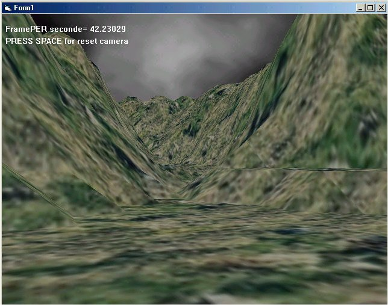



## DX7 engine full release with DLLengine

### Description

This is a 3d engine programming in VB with DirectX7

It support more than 40 useful routines

deals with

Directsound,direct3dsound

Direct Music

Direct input

Direct draw

Direct3d

That is basic use of johnaDX7 engine

it shows how to initialize the Backbuffer and Zbuffer engine

it show how to caps user key input from keyboard

for explanation

write me at Johna.pop@caramail.com

if you like my engine write me and vote for me

if you want the engine source code email me

----

This is the Version 1.01

it support Texture maping

-Multitexturing 2 level on my P2 333 with phonix Vanta

-Fog linar or exponentiel

-Terrain gererating

-Texture creation from JPEG,BMP,GIF files

-Directsound is support and Dsound3d

-Direct music is support

-light mapping in multitexturing FX tools method

-hight precision terrain colision detection

-Basic actor camera mov

-Walk

-turn arround

-jumping

-and many more

-Basic geometric object genarating as cube ect..

-and many others interesting useful stuff.....

----

Download the Demo and the engine

at www.multimania.com/johnapo

or the Demo file at

http://www.multimania.com/johnapop/Johna%20Dx7%20engine%20%20%20Demo1.zip
 
### More Info
 

             |
---                |---
**Submitted On**   |2001-08-07 21:07:42
**By**             |[polaris](https://github.com/Planet-Source-Code/PSCIndex/blob/master/ByAuthor/polaris.md)
**Level**          |Advanced
**User Rating**    |4.7 (42 globes from 9 users)
**Compatibility**  |VB 4\.0 \(32\-bit\), VB 5\.0, VB 6\.0
**Category**       |[DirectX](https://github.com/Planet-Source-Code/PSCIndex/blob/master/ByCategory/directx__1-44.md)
**World**          |[Visual Basic](https://github.com/Planet-Source-Code/PSCIndex/blob/master/ByWorld/visual-basic.md)
**Archive File**   |[DX7 engine24226872001\.zip](https://github.com/Planet-Source-Code/polaris-dx7-engine-full-release-with-dllengine__1-25946/archive/master.zip)

